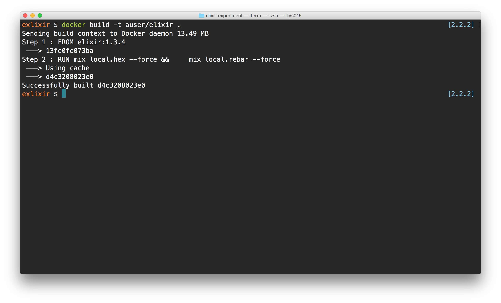
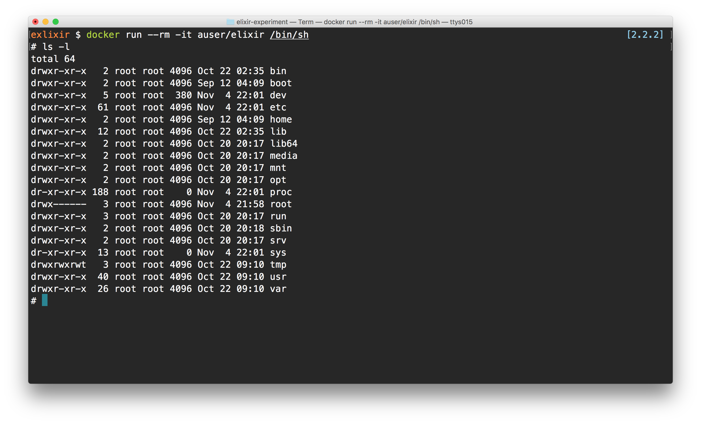

## Release

We're releasing to Google Cloud in this class using [docker-machine](https://docs.docker.com/machine/).

First, install the docker-machine tool from the [https://docs.docker.com/machine/](https://docs.docker.com/machine/) page.

Once we have this dependency, we will need to build a docker image to run our application from within. We'll use some default docker functions to do this.

### Build a docker machine on google cloud

In order to build into a docker image, we'll need a machine running docker. Docker-machine makes this pretty easy. 

> ## Why docker-machine
>
> Docker-machine makes building docker environments in multiple platforms simple. In this case, we'll be building against the google cloud engine, but we can just as easily build our environment with aws, virtualbox, or any other cloud provider supported by docker-machine. 

Let's create a google cloud environment with docker-machine where our docker image will live. In order to do this, we'll need to sign up for GCE at the google cloud platform page at [https://console.cloud.google.com/home/dashboard](https://console.cloud.google.com/home/dashboard)


Create a project we'll work within. In our example, we'll work in a project called `elixir-bridge`, but we can name is anything we want. Next, we'll need to enable the google compute apis in this project. 

Find the Library tab and search for the compute api


Find the compute api and navigate to the page. Here, find the `Enable` button and enable the API for this project.

### Building a docker environment

With the GCE (google cloud engine) side setup, let's create the google container environment. We'll use the docker-machine command to create an app environment. 

```bash
docker-machine create --driver google \
          --google-project [YOUR_PROJECT_ID] \
          --google-zone us-central1-a \
          --google-machine-type f1-micro \
          elixir-experiment
```

When we run this command, we'll have an environment set up for our docker containers to run. In order for us to operate in the docker container, we'll need to set up some environment variables to manipulate the docker environment. Luckily, docker-machine makes this easy as well.

In our terminal, let's execute the following:

```bash
eval $(docker-machine env elixir-experiment)
```

This command adds a few environment variables to our shell, which tells our docker command-line tool which docker server to communicate. Try typing the following in our terminal:

```bash
docker ps
```

If everything works, this will list an empty list of docker machines. 

Once this is set up, we're ready to create our docker instance build system.

## Creating a reproducible deployment

Once nice feature of using Docker is it's ability to create reproducible environments. Let's see this in action and get our application deployed using Docker and Dockerfiles.

Before we jump to writing our `Dockerfile`, let's add an elixir dependency to allow us to build releasable versions of our application. In our `deps`, let's add the `exrm` package to our `mix.exs` file:

```elixir
defmodule Thing.Mixfile do
  use Mix.Projec
  # ...
  defp deps do
    [{:cowboy, "~> 1.0"},
    {:exrm, "~> 1.0"}
  ]
  end
``` 

As we have to do anytime we update our `mix.exs` file, let's fetch the latest dependencies:

```bash
mix deps.get
```

After we have the `exrm` package installed, notice we can now call new release tasks with mix.

Let's create a `Dockerfile` in the root directory of our application:

```bash
touch Dockerfile
``` 

Now, let's build up our `Dockerfile`. We'll base our docker image off the `elixir` base image provided by [hub.docker.io](https://hub.docker.io).

> It's possible to base our image off a different base image, even a bare-minimum one. The elixir base image is a pretty good one to star out with as we won't need to install any of the elixir dependencies (except for our hex packager). 

To base our docker image off the elixir base image, we can add the `FROM` command at the top of the `Dockerfile`:

```Dockerfile
FROM elixir:1.3.4
```

Although there are ways to avoid needing to install the elixir developer tools in our base image, we'll start out by installing them in our base docker image. Let's add the following lines:

```Dockerfile
FROM elixir:1.3.4

RUN mix local.hex --force && \
    mix local.rebar --force
```

Although this won't actually do anything yet, let's build this image to see the steps we'll take when building our working docker image.

### Building the docker image

When working with docker, we'll create snapshots of our running image. We can create a snapshot by using the `docker build` command in our terminal in the same directory as our `Dockerfile`.

We'll want to create a reachable snapshot of this image. We can either do this by using the shasum created by the `docker build` command or, the easier, more memorable `tag` name. Let's prefer to use a tag name by passing the `-t` flag, like so:

```bash
docker build -t auser/elixir ./Dockerfile
``` 

If everything works, we'll see the output:



To use this image in docker, let's launch the image while running a shell which we can run commands against. We'll use the `docker run` command this time:

```bash
docker run --rm -it auser/elixir /bin/sh
```

If all goes well, we'll see a command prompt connected to our running docker image.



> To disconnect from our image, we'll shut it down by pressing `Ctrl+d`

Our docker image, although it is running, it doesn't do very much. Let's change this. In order to tell our docker image to run something, we'll need to take the following steps:

1. Copy our working files to the docker image
2. Build our application in the docker image
3. Create a start script
4. Run the start script on docker image launch

### 1. Copying our working files

Let's start from step one. We'll copy our working files to the docker image using the `COPY` command. 

```Dockerfile
FROM elixir:1.3.4

RUN mix local.hex --force && \
    mix local.rebar --force

## Copy our working files to the /build directory
## in the docker image
COPY . /build
```

### 2. Building our application on the image

Moving on to step 2, we'll want to build a copy of our elixir environment on the docker image. If we were building our application on the _exact same_ infrastructure as our development machine, we could build our application locally and just sync this machine up to our docker image. However, this isn't always the case. Thus, we'll want to build our applcation directly on the docker image.

Luckily, this is pretty easy to do with docker and elixir. 

```Dockerfile
FROM elixir:1.3.4

RUN mix local.hex --force && \
    mix local.rebar --force

## Copy our working files to the /build directory
## in the docker image
COPY . /build
## Compile our application

WORKDIR /build
RUN mix do deps.get, deps.compile && \
    mix do compile, release
```

### 2.1 Dynamic arguments

As it stands right now, building the docker image is a static process, however when we build our application, we'll want to be able to control the built version of our application. By doing this, we'll be able to do some hot-loading of production code and handle rollbacks of broken code, etc. Suffice to say, this is a pretty important feature in Elixir.

In any case, we'll want to be able to send in some dynamic arguments when building our application. Docker makes this pretty easy to do by using a combination of the `ARG` and `ENV` keywords. Let's tell Docker that we expect to pass in the `APP_NAME` and `APP_VERSION` when building our docker image.

```Dockerfile
FROM elixir:1.3.4

ENV DEBIAN_FRONTEND=noninteractive

ARG APP_NAME
ARG APP_VERSION
ENV PORT 4000
ENV MIX_ENV prod

RUN mix local.hex --force && \
    mix local.rebar --force

## ...
```

Now within our docker environment, we can use these arguments directly in the `Dockerfile` by referencing them like unix variables. This is important so we can create a start script for our application within our docker image.

To pass arguments to the `docker build` command, we'll use the `--build-arg` command. For instance, to build our application with the app name of `thing` and a version of `0.1.0`, we'll run the following command:

```bash
docker build -t auser/elixir \
      --build-arg APP_NAME=thing \
      --build-arg APP_VERSION=0.1.0 .
``` 

### 3. Start script

The next part is a bit verbose, but it provides an explicit environment for running our elixir application. Basically, we'll create a directory based on the app name in the `/` of our image.

In addition, let's create a start script that we'll run to boot up our application on the instance. 

```Dockerfile
FROM elixir:1.3.4

ENV DEBIAN_FRONTEND=noninteractive

ARG APP_NAME
ARG APP_VERSION
ENV PORT 4000
ENV MIX_ENV prod

RUN mix local.hex --force && \
    mix local.rebar --force

COPY . /build

WORKDIR /build
RUN mix do deps.get, deps.compile && \
    mix do compile, release    

## Create the start script
RUN mkdir -p /$APP_NAME && \
    mkdir -p /$APP_NAME/releases/$APP_VERSION

RUN mv rel/$APP_NAME/bin /$APP_NAME/bin && \
    mv rel/$APP_NAME/lib /$APP_NAME/lib && \
    mv rel/$APP_NAME/releases/start_erl.data /$APP_NAME/releases/start_erl.data &&\
    mv rel/$APP_NAME/releases/$APP_VERSION /$APP_NAME/releases

RUN ln -s /$APP_NAME/bin/$APP_NAME bin/start
```

Now we'll have a working application ready to boot by calling the `/$APP_NAME/bin/start` script.

### 4. Launching our app at boot

Finally, let's start up our application when the instance is built. In order to do this, we'll make the root directory of our app the working directory and call the `bin/start` script.

```Dockerfile
FROM elixir:1.3.4

ENV DEBIAN_FRONTEND=noninteractive

ARG APP_NAME
ARG APP_VERSION
ENV PORT 4000
ENV MIX_ENV prod

RUN mix local.hex --force && \
    mix local.rebar --force

COPY . /build

WORKDIR /build
RUN mix do deps.get, deps.compile && \
    mix do compile, release    

## Create the start script
WORKDIR /build
RUN mkdir -p /$APP_NAME && \
    mkdir -p /$APP_NAME/releases/$APP_VERSION

RUN mv rel/$APP_NAME/bin /$APP_NAME/bin && \
    mv rel/$APP_NAME/lib /$APP_NAME/lib && \
    mv rel/$APP_NAME/releases/start_erl.data /$APP_NAME/releases/start_erl.data &&\
    mv rel/$APP_NAME/releases/$APP_VERSION /$APP_NAME/releases

RUN ln -s /$APP_NAME/bin/$APP_NAME bin/start

WORKDIR /$APP_NAME

CMD trap exit TERM; bin/start foreground & wait
```

### Launching our app

We're _almost_ ready to deploy our application into a real environment. The last thing we need to take care of is exposing a port for our application to be able to contact it. By default, docker won't open any ports on a container. This is purposeful, but kind of inconvenient. Luckily, opening a port is _easy as pie_ with Docker.

Let's add the `EXPOSE` keyword above the `CMD` with the PORT we want to expose:

```Dockerfile
## ...
WORKDIR /$APP_NAME
EXPOSE $PORT
CMD trap exit TERM; bin/start foreground & wait
```

Perfect. Let's start up our docker instance. We'll need to map a port between our host machine and the docker instance. This way when we make a request to the docker server at a specific port, the docker server knows which docker instance to send the request. We can do this by running the `docker run` command with the `-p` flag (or the `-P` to open _all_ ports -- not recommended).

Let's start up our application with the port mapped on port 4000:

```bash
docker run --rm -it -p 4000:4000 auser/elixir
```

This runs our docker instance in interactive mode. We can run our docker instance in non-interactive mode (background) using the `-d` flag:

```bash
docker run -d -p 4000:4000 auser/elixir
```